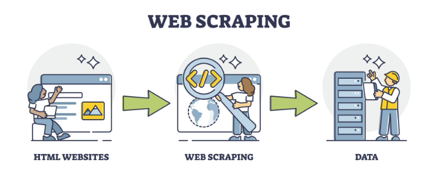
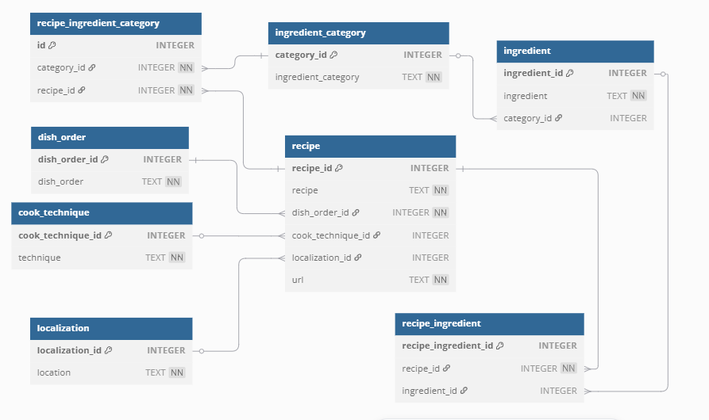
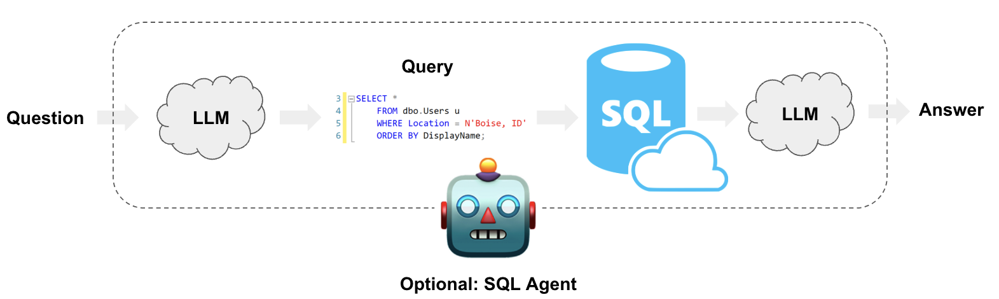

# BASQUE_RECIPE_RAG_PROTOTYPE

-   **Author**: Haizea Rumayor Lazkano
-   **Last update**: April 2025

------------------------------------------------------------------------

This GitHub project explores how small, open-source language models can be combined with **retrieval-augmented generation (RAG)** to interact with relational databases — using Euskera (Basque) as the primary language of communication.

## Overview

The motivation behind this prototype stems from:

1. **Using lightweight, open-source LLMs**: The project intentionally avoids proprietary solutions like paid versions of ChatGPT. Instead, it explores the use of smaller, open-source language models that can be run locally on a personal computer without requiring high-end hardware.

2. **Interacting in a minority language (Euskera)**: As a native speaker, I wanted to investigate how well current language models can understand and respond in Euskera. As expected, the model struggled with direct prompts in Euskera, making it necessary to incorporate English translation as an intermediate step. This highlights the current limitations in handling lesser-resourced languages and opens the door for future improvements.

3. **Applying RAG to relational databases**: Since most companies rely on relational databases to store operational data, I was particularly interested in exploring how retrieval-augmented generation (RAG) techniques could be applied in this context. 

This project is not only a technical prototype, but also a small-scale exploration of how users can effectively interact with LLMs, taking into account both technological and linguistic constraints.

## Key Features

- **Web Scraping**: Extracts data from online sources about traditional Basque recipes.
- **Data Preprocessing & NLP**: Cleans and processes the scraped data to make it suitable for querying.
- **Relational Database**: Structures the data into a relational database for efficient access and querying.
- **Conversation Simulation**: Implements an Ollama-based chatbot model that understands and responds in Euskera.
- **Retrieval-Augmented Generation (RAG)**: Enhances responses by querying the database for relevant recipe information during conversations.

## Project Structure

The project is organized into the following main directories and files:

- **src/**: Contains the main Python scripts for each project step.
  - `1-get_recipes_data.py`: Script for web scraping Basque recipes.
  - `2-create_database.py`: Script for creating the relational database from the scraped data.
  And two Jupyter notebooks for the LLM-RAG iteration process: 
     - `3.1-conversation_sim1_[SQL_RAG].ipynb`: Structured Interaction via Prompted Menu.
     - `3.2-conversation_sim2_[SQL_RAG].ipynb`: Free-form Natural Language Interaction.

- **modules/**: Contains reusable function modules used across different steps.
  - `get_data_functions.py`: Functions to support the data collection process.
  - `database_functions.py`: Functions to assist in database creation and management.
  - `llm_database_iteration_functions.py`: Functions for iterating with the LLM and the database.
  - `llm_iteration_functions.py`: Functions for managing LLM interactions.

- **data/**: Stores the final processed data and relational database.  
- **data_tmp/**: Temporary storage for intermediate results during the web scraping step.
- **config.yaml**: Configuration file containing project settings.
- **Dockerfile**: Docker configuration file for containerizing the application.
- **requirements.txt**: List of Python dependencies for the project.
- **run_ollama.sh**: Shell script to start Ollama 
- **supervisord.conf**: Configuration file for supervising the execution of Ollama and Jupyter notebook processes simultaneously.

## Installation and Run Steps

To get started with this project, please follow these steps:

### Prerequisites

1. **Install Docker**: Ensure Docker is installed on your machine. You can download and install it from the [Docker website](https://www.docker.com/products/docker-desktop).

### Building and Running the Docker Image

1. **Navigate to the Project Directory**:
Open your terminal and navigate to the root directory of the project where the `Dockerfile` is located.

2. **Build the Docker Image**:

Run the following command to build the Docker image. Replace `<app>` with the desired application name:

   ```bash
   docker build -t <app> .
   ```

3. **Run the Docker Image**:

Once the image is built, run the following command to start the Docker container. Replace `<app>` with the corresponding application name:

   ```bash
   docker run -it -p 11434:11434 -p 8888:8888 <app>
   ```

This will run the application and expose the necessary ports:
- Port **11434** for Ollama.
- Port **8888** for Jupyter Notebook.

After running the container, you can interact with the LLM model and Jupyter notebook as described in the project documentation.

# Data Collection and Database Creation

The first challenge in this project was finding valuable, free, and open-source resources written in Euskera (Basque) to use as a knowledge base.

After exploring several options, the selected source was the Basque recipe book on Wikipedia: [Sukaldaritza Liburua](https://eu.wikibooks.org/wiki/Sukaldaritza_liburua/Azala). This source was chosen because:

- It includes a wide variety of traditional recipes, organized by ingredients, dish order (starter, main, dessert), and other useful categories.
- It presents a non-standardized structure, which creates interesting challenges for processing: many recipes are duplicated or written in inconsistent formats. For example, *"Antxoa frijitua"*, *"Antxua frijitua"*, and *"Antxoa frijituak"* refer to the same dish, but differ in plural/singular usage and dialect variations.
- These inconsistencies made **data cleaning and normalization** a particularly engaging task, especially given the added complexity of working with a minority language like Euskera, where NLP tools such as stemming and lemmatization are more limited.

## Web Scraping

The recipe data was extracted using **web scraping** techniques, implemented in `1-get_recipes_data.py`. Web scraping involves automatically accessing and extracting structured information from websites. In this case, it allowed to gather recipes, ingredient lists, and classification information from multiple subpages of the recipe book.




## Data Preprocessing and NLP

Once the raw data was collected, **several preprocessing and Natural Language Processing (NLP)** steps were applied to clean, complete, and structure the information into a usable format for database storage.

These steps were implemented in both the main script and helper modules, and include:

1. **Step 1: Scrape and Store Dictionaries**
   - Recipes and their ingredients.
   - Recipes grouped by dish type.
   - Recipes grouped by cooking technique.

2. **Step 2: Combine All Dictionaries into a Unified DataFrame**

3. **Step 3: Clean Recipe Titles**
   - Fix misspellings and remove unwanted characters.
   - Normalize capitalization.
   - Remove embedded digits or formatting artifacts.

4. **Step 4: Group Recipes by Ingredient Usage**

5. **Step 5: Remove Duplicated Recipes**
   - Merge identical recipes listed under slightly different names.

6. **Step 6: Identify and Complete Missing Dish Orders**
   - Use ingredient patterns to infer dish type (e.g., meat/fish-based recipes likely correspond to main dishes).
   - In some cases, prompt the user to manually assign missing classifications.

7. **Step 7: Identify and Fix Missing Cooking Techniques**
   - Use synonym matching logic to unify similar techniques (e.g., *uretako* ↔ *egosia*).

8. **Step 8: Tag Recipes with Potential Country of Origin**
   - Identify international dishes (e.g., *tagliatelle*, *caprese*) and tag them accordingly.

9. **Step 9: Enhance Ingredient Detection**
   - Normalize text to make ingredient recognition easier.
   - Add inferred ingredients based on recipe context.

10. **Step 10: Extract and Enrich Ingredient Lists Per Recipe**

11. **Step 11: Correct Ingredient Names and Suffixes**
    - Clean up spelling errors.
    - Remove grammatical suffixes and normalize ingredient names for better matching.

## Database creation

The resulting structured data was then **organized and stored** in a **relational database**, created using the `2-create_database.py` script, making it ready to be queried and connected to the language model for **RAG-based interactions**.



## SQL-RAG Implementation

The project incorporates a **conversation simulation model** using the **Llama 3.2:1B** open-source large language model, enabling users to retrieve contextual recipe information through **retrieval-augmented generation (RAG)** — while interacting in **Euskera (Basque)**.

Since LLMs still have limited understanding of minority languages like Euskera, it was necessary to integrate a **translation pipeline** using the [Elia.eus](https://www.elia.eus/) translator to mediate between the user and the LLM. User inputs in Euskera are translated to English before being sent to the model, and responses from the model are translated back to Euskera — enabling a smooth bilingual dialogue.



To explore the interaction between the language model and a relational database using **prompt-based logic** and **RAG**, two different conversation simulations were carried out:

---

### Simulation 1: Structured Interaction via Prompted Menu

In this first scenario, the model is guided through **explicit prompts** to simulate a **menu-based conversation**. The user is presented with structured options such as:

- Checking how many recipes are stored in the database.
- Discovering the most frequently used ingredients.
- Browsing basic recipe information.

The prompts include detailed instructions that tell the model how to interpret each menu item and how to build the corresponding SQL queries. This allows for precise, testable interactions and control over the flow of the dialogue.

---

### Simulation 2: Free-form Natural Language Interaction  

This second simulation mimics a more **realistic user interaction**, where the user provides an open-ended instruction, for example:

> “I want to make a pizza.”

The model interprets this as an intention to cook or find a recipe. Using a **prompt-engineered pipeline**, the model extracts structured information such as:

- Dish name: "pizza"
- Likely ingredients
- Potential ingredient categories

This data is formatted into a **structured JSON object**, like:

```json
{
  "concrete_recipe_ask": true,
  "concrete_food_ask": false,
  "recipe_name": "zurrukutuna",
  "food_name": null,
  "ingredients": ["salted cod", "garlic", "bread", "olive oil"],
  "ingredient_categories": ["fish", "aromatics", "grains", "oils"]
}
```

Based on this output, a second prompt generates a relevant **SQL query**, which is then executed to retrieve matching recipes or ingredients from the **relational database**.

This simulation tests the system’s ability to:

- **Understand open-ended user intents**.
- **Break down vague input** into structured semantic components.
- **Automatically generate SQL queries** from user goals.
- **Deliver context-aware results** — all while enabling communication in **Euskera (Basque)**.

